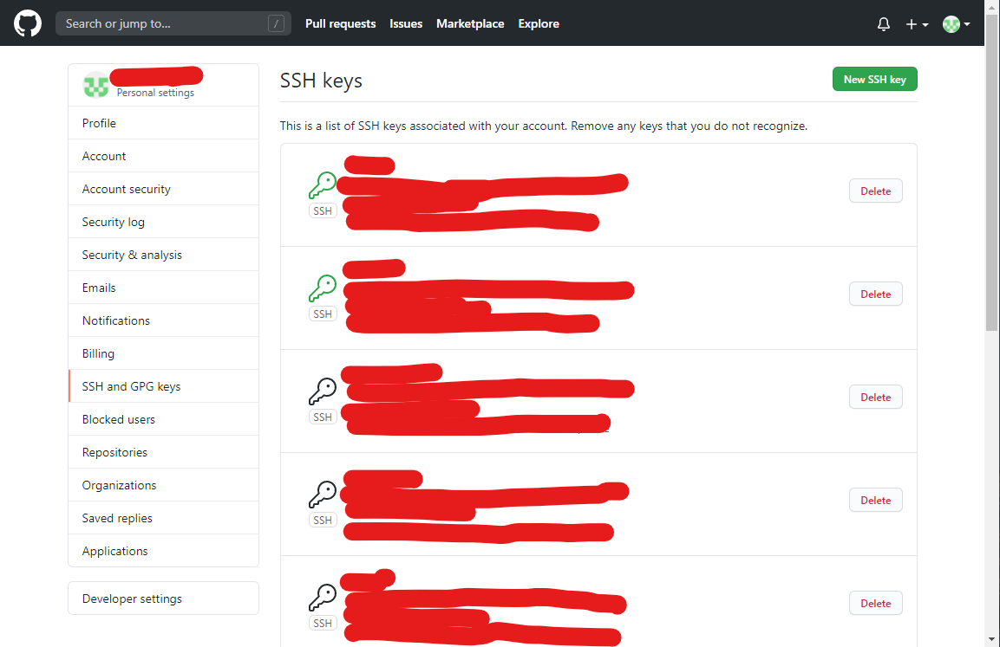
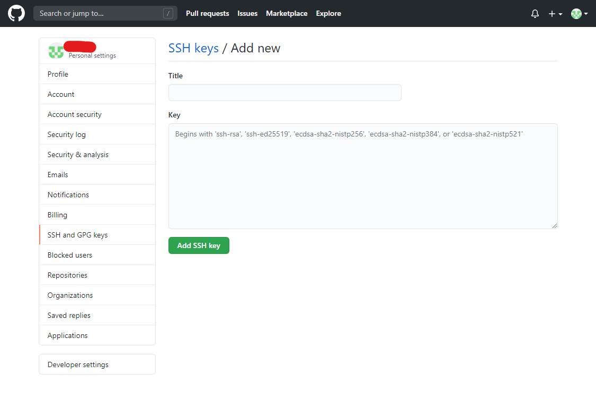
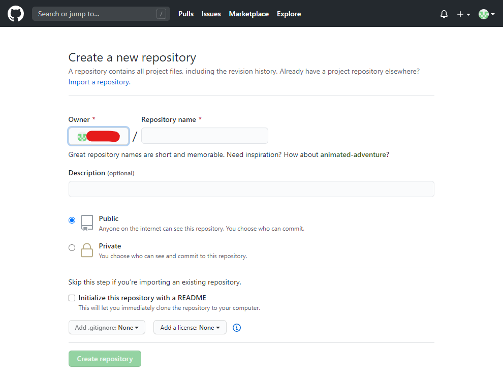
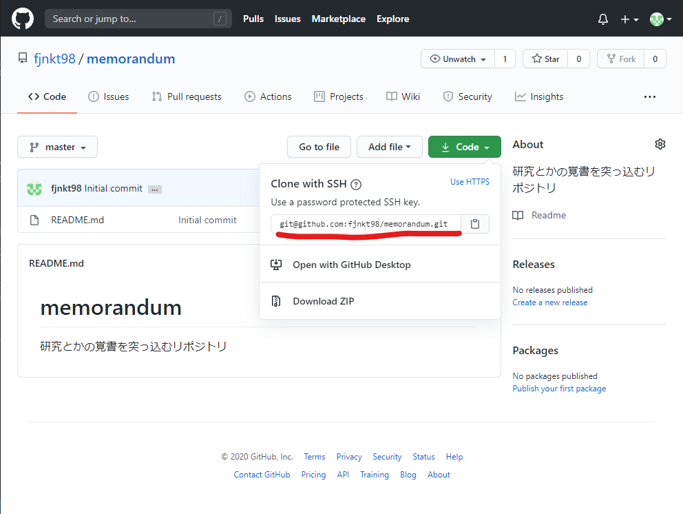

# Git/GitHubで開発するときのメモ

プロジェクトをGit/GitHubで管理して開発を進める際の覚書です．

尚，GitのインストールとGitHubアカウントの作成は済んでいるものとします．

## SSH接続の設定をしておく

マシンとGitHubでSSH接続によって通信できるようにするために，設定を行います．  
作業の流れは以下の通りです．

1. [ローカルでSSH鍵を生成する](###SSH鍵の生成)
2. [公開鍵をGitHubに登録する](###公開鍵をGitHubに登録する)
3. [configファイルを作り，編集する](###configファイルを作り，編集する)
4. [接続確認を行う](###configファイルを作り，編集する)

### SSH鍵の生成

鍵を生成するには，`ssh-keygen`コマンドを使用します．Linuxの場合はそのままターミナルで，Windows10の場合はGit Bashで作業します．

```bash
cd ~/.ssh
ssh-keygen -t rsa -b 4096 -f id_rsa_github
```

`-f`オプションを使うことで，鍵に名前を付けることができます．ここではGitHubへの接続用の鍵として"id_rsa_github"という名前を付けました．

`-f`オプションを使った場合，鍵はカレントディレクトリに生成されます．SSHの鍵は`~/.ssh`ディレクトリに置かれる必要があるので，事前に`~/.ssh`ディレクトリに移動してからコマンドを実行しています．

`~/.ssh`鍵が無い場合は自分で作っておきましょう．もしくは，`-f`オプションを付けずに`ssh-keygen`コマンドを実行すると自動で`~/.ssh`ディレクトリを作った上で鍵を生成してくれるので，そちらを使っても構いません．

### 公開鍵をGitHubに登録する

`ssh-keygen`コマンドで生成した鍵のうち，公開鍵(拡張子が`.pub`のもの)をGitHubに登録します．

ユーザー設定のページに行き，サイドバーのメニューから「SSH and GPG Keys」を選択します．



右上の「New SSH key」をクリックします．



鍵のタイトルと中身の入力を促されます．
タイトルは任意の名前を入力できます．どのデバイスの鍵なのかが分かる名前を付けておきましょう．

鍵の中身は，`cat`コマンドを使ってターミナルに表示させたものをコピーすればOKです．

```bash
cat id_rsa_github.pub
```

"ssh-rsa"から始まる文字列を全てコピーし，ペーストします．

入力が完了したら，「Add SSH key」ボタンを押して公開鍵を登録します．

### configファイルを作り，編集する

公開鍵をGitHubに登録したら，SSH接続のためのconfigファイルを設定します．

`~/.ssh`ディレクトリに移動し，"config"という名前の拡張子の無いファイルを作ります．

```bash
cd ~/.ssh
touch config
```

作ったファイルに設定項目を記述します．GitHubへの接続の場合，以下のように記述します．

```generic
# Github
Host github github.com
    HostName github.com
    IdentityFile ~/.ssh/id_rsa_github
    User git
```

このように設定しなければ，SSHエージェントはSSH接続をする際に`~/.ssh`ディレクトリにあるデフォルト名の鍵(id_rsa)しか参照してくれません．適切な鍵を使用してGitHubへ接続できるように，このような設定を行います．

### 接続確認を行う

全ての設定が完了したら，接続確認をしておきます．接続確認は以下のコマンドで行えます．

```bash
ssh -T github
```

初回接続時には，接続先のアドレスをknown_listに追加するかどうかを聞かれます．yesと答えておきましょう．

接続できた旨のメッセージが出たら設定完了です．

## Gitの設定をしておく

Gitの初期設定として，ユーザー名とメールアドレスの設定を忘れずにしておきます．
ユーザー名とメールアドレスの設定が適切にされていないと，GitHubにコミットをプッシュしたときに名前が上手く表示されません．

設定はコマンドラインで行います．以下のように設定します．

```bash
git config --global user.name "ユーザー名"
git config --global user.email "メールアドレス"
```

ユーザー名とメールアドレスはダブルクォーテーションで囲みます．全角文字は使えません．

お好みでGitのコミットメッセージを編集するエディタを設定しておきましょう．デフォルトはVimになっています．

```bash
git config --global core.editor 'vim -c "set fenc=utf-8"'
```

## プロジェクトをGitの管理下におく

Gitを使ったプロジェクト開発を始めるにあたって，始め方は2つ考えられます．
尚，ここでは単独での開発を想定しているので，共同開発等は考えていません．

1. GitHub上でリポジトリを作ってローカルにクローンする．
2. ローカル上でリポジトリを作ってGitHubにプッシュする

基本的には1.の方法を取ることをお勧めします．リモートURLの設定をする必要が無い，README.mdや.gitignoreやライセンスを自動生成してくれる，最初のコミットを自動生成してくれるなどの利点があるからです．

しかし，例えばROSパッケージなど，ローカル上で何らかのコマンドを使わないとプロジェクトディレクトリが作れない場合もあります．そのような場合には2.の方法を使うことになります．

### GitHub上でリポジトリを作ってローカルにクローンする

GitHubでの作業はブラウザで行うことになります．自分のGitHubユーザーページへ移動し，"Repositories"タブから新しいリポジトリの作成画面へ移動します．

リポジトリ作成画面に移動するとこのような画面が表示されます．



リポジトリ名，説明文を入力すればリポジトリを作成することができます．
また，リポジトリを公開するか否かの設定をここで行うことができます．後から設定することも可能です．

GitHub上でリポジトリを作る際は，"Initialize this repository with a README"にチェックを入れておくことをお勧めします．また，`.gitignore`のテンプレートもここで追加しておくことをお勧めします．ただし，どちらも後から追加することが可能なので無理にやることはありません．

ライセンスについても同様に，リポジトリを作成した後から追加することが可能です．リポジトリ作成時点でライセンスの種類を決められない場合は，後から追加しましょう．

リポジトリが作成できたら，ローカルにクローンします．リポジトリのページにある「Code」プルダウンメニューを開き，書かれているアドレスをコピーします．



このアドレスを使って，リポジトリをローカルにクローンします．
リポジトリのクローンは以下のようなコマンドで行うことができます．

```bash
git clone git@github.com:XXXXX/XXXXXX.git
```

リポジトリをクローンできたら後は開発を進めるだけです．

### ローカル上でリポジトリを作ってGitHubにプッシュする

一方で，ローカルでしかプロジェクトディレクトリを作れない場合もあります(例えばROSパッケージ等)．その場合はローカルでGitリポジトリを初期化し，GitHubにアップロードする必要があります．

※ここで説明する手順はGitHubで空のリポジトリを作った際に表示されるQuick Setupに書かれているものと同様のものです．

まず，GitHubで空のリポジトリを作成します．リポジトリを作成する手順は先ほどの節と同じですが，注意点が2つあります．

1. リポジトリの名前をプロジェクトディレクトリの名前と同じものにする
2. GitHub側でREADME.mdや`.gitignore`，ライセンスを生成しない(空っぽにする)

リポジトリ名をディレクトリ名と同じにする必要は実はありませんが，分かりやすさを重視して同じ名前にしておきます．また，GitHub側でREADME.md等のファイルを生成しておくと，ローカルからプッシュするときにコンフリクトが発生する可能性があります．これらのファイルは後から追加することも可能なので，空のまま作っておきましょう．

ここからはローカルでの作業です．Gitリポジトリを初期化します．  
リポジトリにしたいディレクトリに移動し，`git init`コマンドを使って初期化します．

```bash
cd /path/to/project/directory
git init
```

その後，README.mdを新たに作ります．これは，リポジトリを初期化してから最初のコミットとして追加する用のものです．

```bash
echo "# HOGE" >> README.md
```

最初のコミットとしてREADME.mdを指定します．addしてcommitするだけです．

```bash
git add README.md
git commit -m "first commit"
```

無事に最初のコミットを作ることができたら，リモートリポジトリのアドレスを設定します．追加するアドレスは，リポジトリをクローンするときに使うアドレスと同じです．

```bash
git remote add origin git@github.com:XXXXX/XXXXX.git
```

最後に，ローカルの内容をリモートにプッシュします．`-u`オプションは最初にプッシュするときに付けるオプションなので，これ以降は付ける必要は無いです．

```bash
git push -u origin master
```

これで，ローカルリポジトリとリモートリポジトリの紐づけが完了しました．後は開発を進めるだけです．
