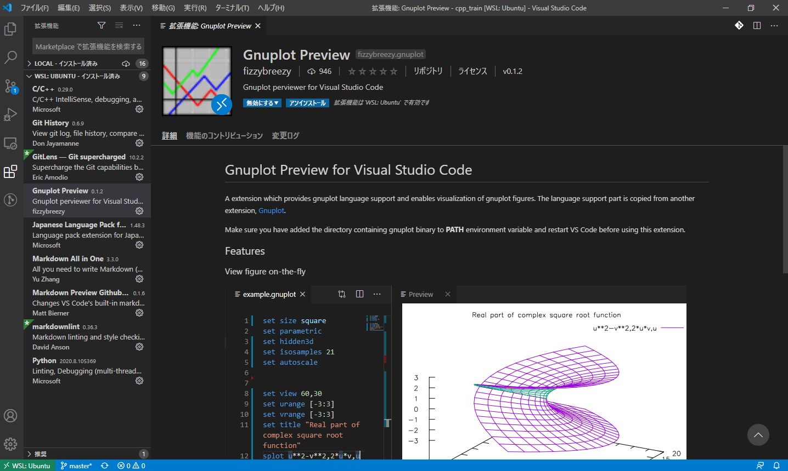
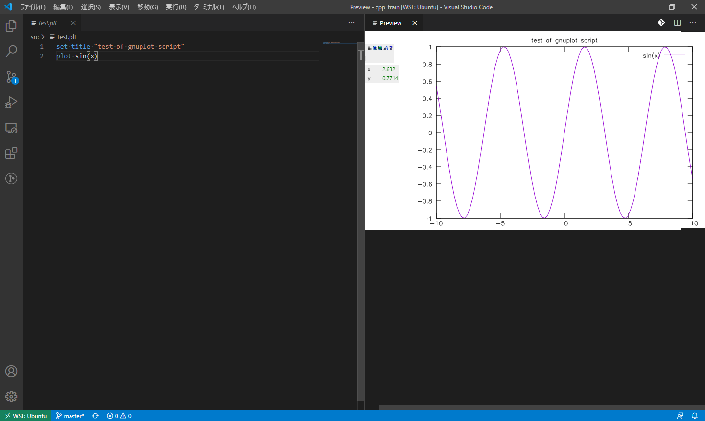

# WSLにgnuplotをインストールしてVSCodeから使う

## 目的

C++からgnuplotを呼び出してグラフを描画したりアニメーションを作成したりするため．

## 環境

- Windows10 1909
- Ubuntu 20.04(WSL1)

## 手順

### gnuplotのインストール

gnuplotは`apt`からインストールすることができます．最新のバージョンを必要としないならばこれを使うのが手軽です．

```bash
sudo apt update
sudo apt install gnuplot
```

### 依存ライブラリの問題の解決

しかし，GUIを持たないWSLでは，そのままの状態ではgnuplotを起動することができません．以下のようなエラーが発生します．

```console
$ gnuplot
gnuplot: error while loading shared libraries: libQt5Core.so.5: cannot open shared object file: No such file or directory
```

これを解決するには，エラーメッセージに表示されている共有ライブラリに手を加えます．具体的には，以下のコマンドを実行します．

```bash
sudo strip --remove-section=.note.ABI-tag /usr/lib/x86_64-linux-gnu/libQt5Core.so.5.*
```

`*`の部分には，現在WSL上にインストールされている`libQt5Core.so`のバージョンに応じて変更します．どのバージョンがどこにインストールされているかは，以下のコマンドで調べます．

```bash
find /usr/lib/ -name libQt5Core.so.5.*
```

この環境では以下の2つが見つかりました．

```console
$ find /usr/lib/ -name libQt5Core.so.5.*
/usr/lib/x86_64-linux-gnu/libQt5Core.so.5.12
/usr/lib/x86_64-linux-gnu/libQt5Core.so.5.12.8
```

これらのファイルに対して`strip`コマンドをそれぞれ実行します．以下のようになります．

```bash
sudo strip --remove-section=.note.ABI-tag /usr/lib/x86_64-linux-gnu/libQt5Core.so.5.12
sudo strip --remove-section=.note.ABI-tag /usr/lib/x86_64-linux-gnu/libQt5Core.so.5.12.8
```

これで，gnuplotコマンドが使えるようになります．

2020年9月3日現在，Ubuntu 20.04ではversion 5.2がインストールされました．

```console
$ gnuplot --version
gnuplot 5.2 patchlevel 8
```

## 使い方

WSLはGUIを持たないので，Windows側にX Windowをインストールしない限り，プロットしたグラフを表示することができません．

基本的には，プロットしたグラフをファイルにエクスポートするか，あるいはVSCodeの[Gnuplot Preview](https://marketplace.visualstudio.com/items?itemName=fizzybreezy.gnuplot)拡張を使うことになります．

拡張機能から「Gnuplot Preview」をインストールします．VSCode向けのgnuplot拡張はいくつか種類がありますが，fizzybreezy氏の「Gnuplot Preview」をインストールします．



VSCode上でgnuplotを使うには，まず拡張子が`*.plt`のファイルを用意します．ここでは`test.plt`というファイルを作成します．

`test.plt`に以下のような内容を記述します．動作テストなので適当な内容です．

```Gnuplot
set title "test of gnuplot script"
plot sin(x)
```

ファイルを開いた状態で，コマンドパレットを開き，`Gnuplot: Gnuplot Preview Figure`を実行することで，プロットしたグラフのプレビューを見ることができます．



## 参考にしたサイト

- [WSLのArchLinuxでgnuplotが使えない](https://qiita.com/ryoi084/items/d004f2dca50c1dcb0d07)
- [strip - コマンド (プログラム) の説明 - Linux コマンド集 一覧表](https://kazmax.zpp.jp/cmd/s/strip.1.html)
