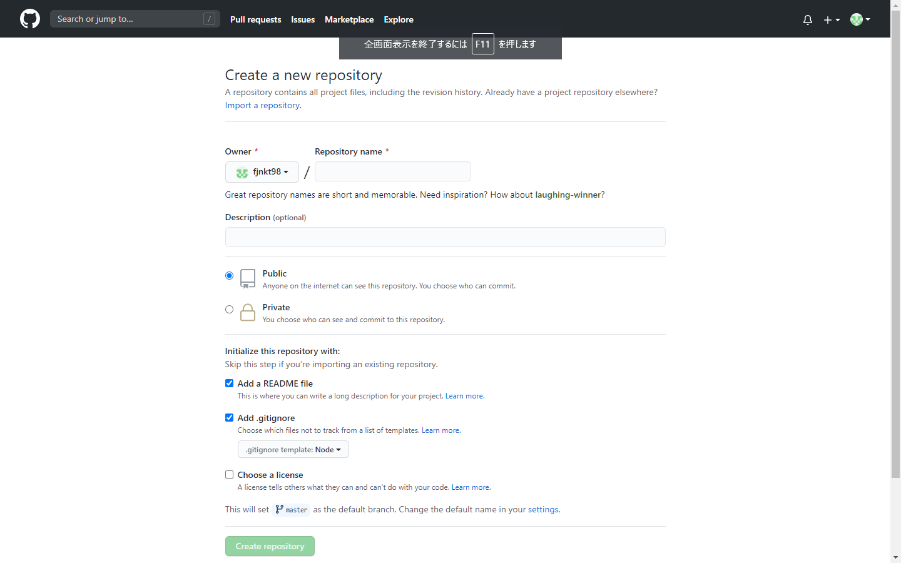

# HonKitの始め方 with GitHub Pages

## 概要

このページでは，[HonKit](https://github.com/honkit/honkit)を使ったWebサイトの作り方を説明します．

また，作成したWebサイトをGitHub Pagesで公開する方法についても解説します．

## 環境

- Windows10 Home version 1909
- Node.js version 12.18.4
- npm version 6.14.6
- HonKit version 3.6.6
- Git version 2.20.1.windows.1

Node.js，npm，Gitはインストール済みであるとします．

また，環境構築やWebページのビルドのためのコマンド実行はWindowsコマンドプロンプト上で(GitコマンドだけはGit Bash上で)行うものとします．

## 作業手順

### GitHubリポジトリの作成

何はともあれGitHubリポジトリを作ります．[GitHub](https://github.com/)にアクセスし，リポジトリ作成画面に移動します．



リポジトリ名やDescriptionの欄は適当なものを入れておきます．

Node.jsのプロジェクトなので，「Add .gitignore」のチェックをオンにしておき，テンプレートは「Node」を選択しておきます(Noneと間違わないように注意)．

`README.md`も後々使うので，「Add README.md」のチェックもオンにしておきましょう．

リポジトリが作成できたら，自分のPCにリポジトリをクローンします．

### Node.jsプロジェクトのイニシャライズ

Node.jsプロジェクトを作成します．

先程ローカルにクローンしたリポジトリのディレクトリに移動し，以下のコマンドを実行します．これはコマンドプロンプトで実行します．

```bat
npm init --yes
```

このコマンドによって新しいNode.jsプロジェクトが作られ，ディレクトリには`packages.json`ファイルが生成されます．

次に，HonKitをインストールします．以下のコマンドを実行してインストールします．

```bat
npm install honkit --save-dev
```

これでHonKitがプロジェクトのローカルにインストールされ，利用できるようになりました．

### Webページの元を準備する

HonKitのコマンドでWebページを作るための準備をします．

#### ディレクトリ構成についての説明

ビルドするには材料となるMarkdownファイルなどが必要になります．これらのソースは`src`というディレクトリにまとめて格納するようにしましょう．  
ついでに，ビルドした結果は`docs`というディレクトリに出力するようにしておきます．これは，後でGitHub Pagesを使って公開するときに楽をするためです．

プロジェクトのディレクトリ構成は以下のようになります．

```generic
./
├─ README.md
├─ .gitignore
├─ src/
│  ├─ README.md
│  ├─ SUMMARY.md
│  ├─ Chapter1/
│  │    ├─ hogehoge.md
│  │    :
│  ├─ Chapter2/
│  │    ├─ mogemoge.md
│  :    :
└─ docs/
   ├─...
   :
```

ここで，プロジェクトのルートにある`README.md`と，`src`ディレクトリのルートにある`README.md`は全く別物であり，持っている役割も異なります．

プロジェクトのルートにある`README.md`はリポジトリの説明を記述するものです．  
一方，`src`ディレクトリのルートにある`README.md`は，HonKitによって作られたWebサイトにアクセスしたときに最初に表示されるコンテンツを記述するファイルです．
いわゆるホームページといって差し支えないでしょう．

#### HonKitプロジェクトのイニシャライズ

では実際にHonKitプロジェクトを作りましょう．

まずはMarkdownファイルを置いておくための`src`ディレクトリを作ります．

```bat
mkdir src
```

次に，以下のコマンドを使ってHonKitプロジェクトをイニシャライズします．

```bat
npx honkit init src
```

このコマンドによって，`src`ディレクトリに`README.md`と`SUMMARY.md`の2つのファイルが生成されます．

あとは`src`ディレクトリ以下にMarkdownファイルを適当に配置していけばよいです．

### Webページのビルド

ある程度記事が書けたら，Webページをビルドしてみます．

プロジェクトのルートディレクトリにて，以下のコマンドを実行します．

```bat
npx honkit build src docs
```

このコマンドによって`src`ディレクトリにあるMarkdownファイル群からHTMLファイルがビルドされ，`docs`ディレクトリに出力されます．

また，以下のコマンドを使うと，出力されたWebページをローカルホストでプレビューすることもできます．

```bat
npx honkit serve src docs
```

デフォルト設定の場合，[http://localhost:4000/](http://localhost:4000/)にアクセスすることでWebページをプレビューできるようになります．

### GitHub Pagesで公開する

TODO: 画像を追加する

Webページを作成したら，GitHub Pagesで公開してみましょう．

`docs`ディレクトリを含むファイル群をGitHubにプッシュします．

その後，GitHubリポジトリのSettingsタブに移動し，GitHub Pagesの設定を行います．

GitHub Pagesに関する設定の中の，Sourceのプルダウンメニューから「master branch /docs folder」を選択します．

これにより，`docs`ディレクトリ以下のWebページがGitHub Pagesで公開され，URLにアクセスすることで閲覧できるようになります．
